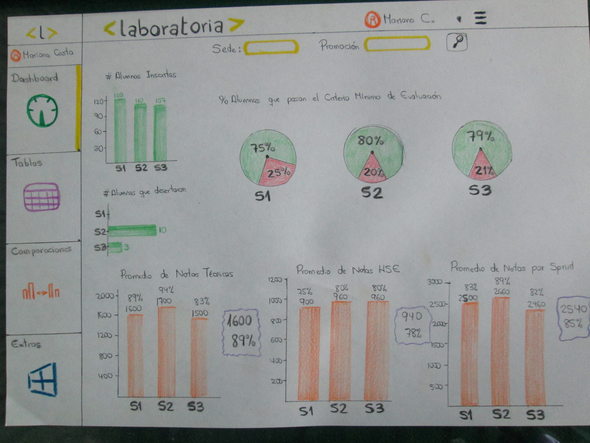

# Sketch para la herramienta del dashboard de Laboratoria

El dashboard es una herramienta utilizada por profesores, training managers, directores y gerentes de Laboratoria para ver rápidamente qué está pasando en el salón de clases de Laboratoria. En el dashboard, los usuarios mencionados pueden ver rápidamente estadísticas y datos en tiempo real como:

+ Nro. de alumnas inscritas
+ Nro. de alumnas que desertaron
+ Nro. y  % de alumnas que pasan el criterio mínimo de evaluación
+ Promedio de notas por sprint
+ Promedio de notas HSE
+ Promedio de notas técnicas

